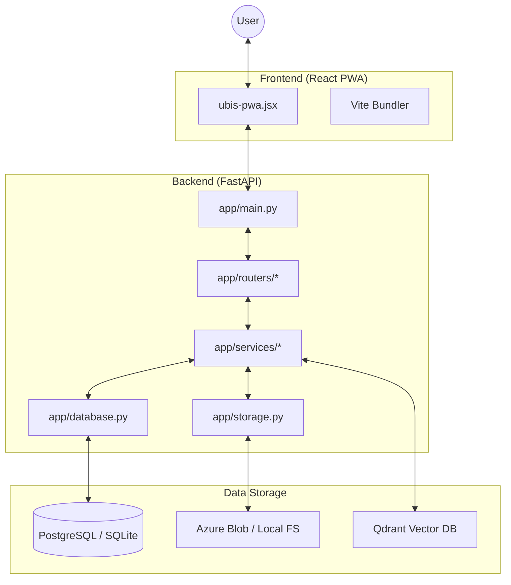

# System Design & Architecture

This document describes the high-level design, architectural patterns, and module structure of the UBIS (Unidentified Body Identification System).

## 1. High-Level Architecture

UBIS is built on a modern, decoupled architecture using a React-based Progressive Web App (PWA) for the frontend and a FastAPI-based REST API for the backend.

## 2. Key Modules

### Frontend Modules
- **Registration**: Handles multi-angle photo capture and attribute entry for unidentified bodies.
- **Search**: Multi-modal search interface (Face, Text, Voice) — Phase 1 scope is the UI-body repository only.
- **Admin Dashboard**: User management, system monitoring, and geo-mapping configuration.

> **Phase 1 scope note:** Criminal-records / proclaimed-offender management and
> missing-person matching are **out of scope** for the Gurugram pilot. The
> backend `/api/criminals` endpoints remain in the codebase but are not exposed
> in the UI.

### Backend Modules
- **`app/routers/`**: Grouped by functional area (auth, submissions, search, match, admin, geo). The `criminals` router is retained for a future phase but not surfaced in the UI.
- **`app/services/`**: Core business logic.
    - `face_embedding.py`: Interface for InsightFace model.
    - `qdrant_client.py`: Vector search operations.
- **`app/database.py`**: Unified database abstraction for SQLite (dev) and PostgreSQL (prod).
- **`app/storage.py`**: Unified file storage abstraction for local filesystem and Azure Blob Storage.

### 2. AI Matching Pipeline

The system uses a state-of-the-art face recognition pipeline:
- **Detection**: InsightFace (Buffalo_L model) for high-accuracy face localized detection.
- **Embedding**: AdaFace (IR-101) for robust 512-dimensional face embeddings.
- **Execution**: Powered by `torch` (PyTorch) with CPU/GPU support (CPU-only by default in Azure App Service).

**Key Dependency**: `torch` is essential for running the AdaFace model and extracting embeddings.
3.  **Vector Storage**: Embeddings are stored in Qdrant with associated metadata.
4.  **Similarity Search**: Cosine similarity is used to find the top-K matching candidates.
5.  **Multi-Modal Ranking**: (Planned/Future) Combining face similarity with attribute-based filtering.

## 4. Design Decisions

- **Single-File PWA Component**: The main business logic of the frontend is consolidated in `ubis-pwa.jsx` for ease of deployment and offline capability.
- **Unified DB Abstraction**: Allows developers to work with local SQLite while deploying to a robust PostgreSQL environment without changing code.
- **Stateless API**: The backend is stateless, with all session info handled via JWT, enabling horizontal scaling on Azure App Service.
